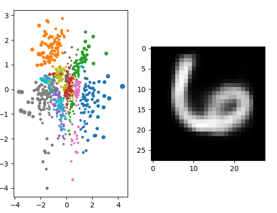

# SimpleVAE implementation in Pytorch - with added interactive visualization

Code is complete with small explanations of the VAE

## How to run
1. Run `python3 run.py` to train the model (this creates `model.pt` in the `checkpoints` folder.
2. Run `python3 visualize.py` to see the latent space for the model you just trained.
